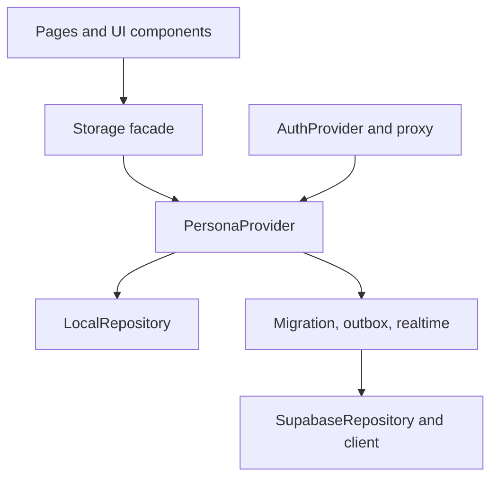

# Security & Performance Audit — 2026-08-09

## Executive summary

Audit target: `agent/supabase-persistence` at `74babce`.

Audit branch: `agent/security-performance-audit`.

No committed credential, private key, high-confidence token, raw SQL injection path,
dangerous HTML sink, circular dependency, or known npm vulnerability was found. The
audit did find security and performance weaknesses worth fixing before V0.2 ships:
cross-account browser-cache reuse, missing browser security headers, mutable GitHub
Action references, a workflow expression-injection path, unbounded personal-data
fields, hardcoded demo content, an `O(P×T)` project/task join, and an `O(M²)` outbox
flush. These findings were remediated on the audit branch.

This is a source/configuration audit, not a claim that the deployed system has passed
a penetration test. Real Supabase RLS, Auth, Realtime, rate-limit, and production
header behavior remain release-gate tests.

## Scope and methods

- 109 Git commits scanned for high-confidence key/token/private-key patterns without
  printing candidate values.
- Current tracked source scanned for secret-like values, sensitive filenames,
  personal-data patterns, dangerous browser sinks, dynamic SQL, raw queries, redirects,
  URLs, debug bypasses, and hardcoded samples.
- `npm audit`, npm registry signature/attestation verification, TypeScript, ESLint,
  production build, dependency graph, complexity rules, LOC analysis, and a synthetic
  algorithm benchmark executed.
- Both original Supabase migrations reviewed table by table for RLS, grants,
  `SECURITY DEFINER`, `search_path`, ownership constraints, indexes, and injection paths.
- Auth shell, proxy, repositories, local migration, outbox, Realtime, user inputs,
  GitHub workflows, and release script reviewed manually.

## Security findings

| ID | Severity | Finding | Resolution |
|---|---:|---|---|
| SEC-01 | High | One generic local-state key could briefly expose or import owner A's cache after owner B authenticated in the same browser profile. | Fixed: Cloud Mode starts from an empty state, cache keys are user-scoped, the legacy snapshot can be claimed by only one user ID, and the app frame remains private until the active cache scope matches the authenticated user. |
| SEC-02 | High | V0.1/V0.2 first-run state contained hardcoded personal/demo tasks, projects, content, focus, and vocabulary. This was not a credential leak, but it mixed sample content with real owner data and could be imported to Cloud. | Fixed: new installations start with an explicit empty Persona state; existing browser data is preserved. |
| SEC-03 | Medium | No CSP or anti-clickjacking/MIME/referrer/permissions/HSTS headers; Next.js disclosed `X-Powered-By`. | Fixed in `next.config.ts`; production response was verified locally. CSP allows only the configured Supabase HTTP/WebSocket origins in `connect-src`. |
| SEC-04 | Medium | GitHub Actions used mutable major tags, and checkout credentials remained persisted in the worktree. | Fixed: all actions are pinned to audited full commit SHAs and checkout uses `persist-credentials: false`. CI defaults to `contents: read`. |
| SEC-05 | Medium | Manual release tag input was interpolated directly into a shell script, permitting shell source injection by a workflow dispatcher. | Fixed: input crosses through `env`, then is validated against a SemVer-shaped tag before use. |
| SEC-06 | Medium | User-controlled text/JSON had no application or database size boundary; the import RPC could occupy a worker for an excessive interval. | Fixed: UI limits, database constraints, platform-count limit, and a 15-second function `statement_timeout` were added. The third migration still requires real-database validation. |
| SEC-07 | Medium | There was no automated repository secret gate. | Fixed: zero-dependency tracked-file scanner added to CI/release; full-history audit found no high-confidence secret. |
| SEC-08 | Low | Login rendered Supabase's raw authentication error message. | Fixed: UI now returns a generic authentication failure, reducing account/provider detail disclosure. |
| SEC-09 | Low | Python diagnostics accepted any future `requests>=2.31.0`, reducing reproducibility. | Fixed: direct dependency pinned to the audited `2.34.2` release. |

### Secrets, hardcoded values, and leakage result

- High-confidence secret patterns in current source: **0**.
- High-confidence secret patterns across 109 commits: **0**.
- Sensitive files ever tracked: only `.env.example`, containing placeholders.
- Dependency vulnerabilities: **0** (`info` through `critical`).
- Registry verification: **407 packages signed; 92 packages attested**.
- Remaining hardcoded values are product copy, enum/domain values, safe storage-key
  names, routes, and public configuration placeholders—not credentials or owner data.

If a real secret is discovered later, deleting it from Git is insufficient: revoke or
rotate it first, then purge history and invalidate caches/artifacts.

### SQL injection and data authorization

No SQL injection path was found:

- browser data access uses Supabase's query builder with values passed through `.eq()`,
  `.upsert()`, and `.rpc()` rather than string-built SQL;
- migrations contain no user-derived dynamic `EXECUTE`, concatenated query, or raw
  application query;
- the import RPC parses JSON fields into typed PostgreSQL values inside a transaction;
- its `SECURITY DEFINER` function has an empty `search_path`, requires `auth.uid()`,
  revokes `PUBLIC`/`anon`, and grants only `authenticated` execution;
- all personal tables have RLS `USING` and `WITH CHECK` owner predicates;
- task→project ownership is enforced again in a trigger, preventing cross-owner IDOR.

Malformed data can still make an import fail safely and roll back. The new timeout and
size constraints bound abuse, but the clean-project migration and A/B-user attack test
are mandatory before release.

### Attack-prevention coverage

| Threat | Current control | Status |
|---|---|---|
| Stored/reflected XSS | React text escaping; no `dangerouslySetInnerHTML`/DOM HTML sink; CSP | Controlled; nonce-based CSP remains stronger future work |
| SQL injection | Supabase parameterized builder; static SQL/RPC; typed casts | No path found |
| IDOR/cross-user access | RLS, explicit owner filters/checks, relationship trigger | Implemented; real A/B test pending |
| Clickjacking | CSP `frame-ancestors 'none'` + `X-Frame-Options: DENY` | Verified locally |
| MIME/content sniffing | `X-Content-Type-Options: nosniff` | Verified locally |
| Open redirect | Only fixed internal `/` and `/login` destinations | No path found |
| SSRF | No server fetch target controlled by a user | No path found |
| CSRF | No state-changing Next server endpoint; browser calls Supabase with authenticated client and RLS | No application path found; Auth cookie behavior still needs production test |
| Brute force/public signup | Supabase Auth controls and dashboard settings | **Unverified release blocker** |
| Resource exhaustion | UI/DB length bounds, RPC timeout, bounded platform count | Improved; load testing pending |
| Supply-chain substitution | lockfile, npm audit/signatures, Actions pinned by SHA | Controlled in CI |
| Secret commit | `.gitignore`, `.env.example`, CI tracked-file scan | Controlled for common high-confidence formats |

## Residual security risks

1. **Real Supabase proof is still missing.** Apply all three migrations to a private
   clean project and execute the A/B-user, RPC-grant, Realtime, offline, and logout
   checklist before merge.
2. **Public signup and Auth rate limits are dashboard controls.** Verify signup is off,
   leaked-password protection/MFA choices are intentional, and rate limits are suitable.
3. **Trusted-device storage remains plaintext.** User-scoped cache prevents logical
   account crossover, but local state, backups, and outbox payloads remain readable to
   scripts executing on the same origin and to anyone with the unlocked browser profile.
4. **CSP still needs `'unsafe-inline'` for current Next/Tailwind rendering.** A nonce- or
   hash-based CSP should be evaluated after deployment architecture is stable.
5. **LocalStorage runtime validation is structural, not schema-complete.** A versioned
   validator should reject malformed/tampered snapshots field by field.
6. **No DAST or browser end-to-end security suite exists.** Add repeatable login/logout,
   cache-scope, oversized-input, CSP, and RLS regression tests.

## Performance and complexity audit

It is neither possible nor desirable to make every operation `O(1)`. Rendering `N`
items, serializing a snapshot, transferring rows, and applying `M` durable mutations
must inspect their data at least once: their lower bound is `Ω(N)` or `Ω(M)`. The useful
goal is to eliminate accidental nested scans and make lookup-heavy paths indexed.

| Path | Before | After | Worst-case note |
|---|---:|---:|---|
| Attach tasks to projects after Cloud fetch | `O(P×T)` | `O(P+T)` | `Map` lookup is expected `O(1)` average; adversarial JS hash behavior is implementation-dependent |
| Outbox local parse/filter/write work for `M` mutations | `O(M²)` | `O(M)` | Network delivery remains sequential `O(M)` to preserve FK/order semantics |
| Diff an unchanged collection reference | `O(N)` | `O(1)` | A changed immutable collection still requires `O(N)` indexing/comparison |
| Database owner + newest-first list | owner index plus sort | composite B-tree `O(log N + K)` | `K` returned rows must still be transferred/rendered |
| Six independent Cloud reads | sequential potential | concurrent `Promise.all` (already present) | Total latency approximates the slowest query, not the sum |

Synthetic join benchmark (Node.js in this audit environment, 1,000 projects and
10,000 tasks, ten runs):

| Implementation | Mean |
|---|---:|
| Nested filter | 102.05 ms/run |
| Indexed map | 0.55 ms/run |

That is roughly **185× faster in this synthetic shape**. It is directional evidence,
not a production SLA.

### Code graph

Madge processed **36 modules and 69 import edges**, finding **0 circular dependencies**.



`PersonaProvider` is the intended central fan-in (eight direct internal imports). That
keeps state ownership coherent, but also makes it a maintenance hotspot.

### Maintainability result

The Inbox refactor reduced its file from **623 to 347 lines** and its main component
from **564 to 301 effective lines**. Its cyclomatic-complexity warning (16) and nested
row-render warning (11) were eliminated by extracting typed row/actions/dialog modules
and shared Inbox predicates. Repository-wide experimental warnings moved from 18 to 16.

Remaining large/high-complexity hotspots, ordered by impact:

1. `PersonaProvider` — split initialization, scoped persistence, Realtime scheduling,
   and mutation delivery into testable hooks/services.
2. `SupabaseRepository.fetchAllState` — extract row mappers and add pagination or
   incremental per-domain loading before personal datasets become large.
3. `GlobalQuickCapture`, Login, Sidebar, and TodayTasks — separate state/controller
   logic from view sections.
4. Realtime refresh — currently debounced but re-fetches the full Persona state; move
   to changed-row reconciliation or domain-level refresh.
5. Local persistence — full-snapshot `JSON.stringify` is `O(S)` per edit; consider a
   debounced IndexedDB repository if real profiles make this measurable.
6. Inbox/Sidebar counters perform linear scans. They are correct and small today; do
   not add derived indexes until profiling shows this path matters.

## Validation evidence

```text
npm ci                                      passed
npm audit --json                            passed: 0 vulnerabilities
npm audit signatures                       passed: 407 signed, 92 attested
npm run security:scan                       passed
npx tsc --noEmit                            passed
npm run lint                                passed
npm run build                               passed: 9/9 static pages
Madge dependency graph                      passed: 36 modules, 69 edges, 0 cycles
experimental complexity/size rules          16 warnings, 0 errors (baseline: 18)
production HTTP security headers             passed with host 127.0.0.1
real Supabase migrations/RLS/Auth/Realtime   not run: private test project required
```

## Release decision

Source-level status: **READY_FOR_REVIEW**.

V0.2 release status remains:
`LOCAL_RELEASE_CHECKS_PASSED_CLOUD_VALIDATION_PENDING`.

Do not merge/tag solely from this audit. The next best action is to apply all three
migrations to a clean private Supabase test project and run the existing V0.2 checklist,
including two-user isolation and a different-account cache-scope test.
